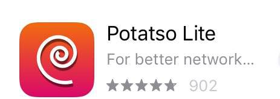

## 苹果手机翻墙步骤
### 第一步：备份重要文件，并在设置页最上方点击您当前Apple ID，进入Apple ID页面，在页面最下方注销（退出登录)您当前Apple ID
在登入美区Apple ID之前，需要退出当前的Apple ID。为防止意外，请务必确认您已经备份了手机上的重要文件，并记下您当前Apple ID的密码，或者使用一个二手/不重要的手机。
### 第二步：在Apple ID页，登录以下临时美区Apple ID，除非您想公开您的相册和通讯录，登入时请务必选择"不合并"数据到iCloud
* Apple ID: **meiriyoutu@icloud.com**
* 密码: **1234567890Aq**
### 第三步：在Apple ID页，点击"iTunes Store与App Store"，确认已登录meiriyoutu@icloud.com
关联美区Apple ID到应用商店后，您就可以搜索/下载美区应用。请务必不要修改Apple ID有关设置，尤其不要开启双重认证。
### 第四步：在应用商店搜索下载免费影梭客户端Potatso Lite

### 第五步：打开Potatso Lite，点添加代理，选择手动输入如下代理
* 类型：**Shadowsocks**
* 服务器：**xxx.xxx.xxx.xxx** (此处请填写有效每日油兔网址，网址被墙须及时更换新址)
* 端口：**2333**
* 加密：**aes-256-cfb**
* 密码：**doub.io**
填写完毕确认无误后，点右上角"√"保存。
### 第六步：在主屏幕，点击最下方红色“开始”按钮开始翻墙
提示VPN权限时，选择允许(Allow)。按钮变为绿色，表示翻墙成功。可以用油管的网址YouTube.com测试梯子是否正常工作。
### 安装应用完毕后，请立刻退出美区Apple ID，登入您原来的Apple ID。使用共享的Apple ID，如果遇到恶意用户，可以追踪到您手机的位置，甚至导致您的手机无法开机登录。
## 附录
### 学会翻墙后，请搜索安装电报加密聊天软件（Telegram）。安装电报无需翻墙，但注册和使用需要翻墙。通过电报您可以自助获取大量免费/收费影梭代理，并和其他翻墙出来的同道进行更自由的交流。

### 电报注册需要电话号码接受短信，并打开梯子翻墙。最好是用TextNow或者叮咚去注册一个北美的假电话号码，然后用这个号码注册telegram。如果不会注册，用大陆号码也可以，反正别人看不见你的号码的。 TextNow注册号码是免费的，但是全英文，看不懂的话就用翻译软件，不难。叮咚全中文，但是号码一年要13元人民币，微信支付宝都可支付。注册登录成功后先搜索@zh_CN进入中文汉化频道汉化您的界面，再到设置里面添加一个唯一用户名，把用户名私发给微信号wanggonging，拉您进群。

